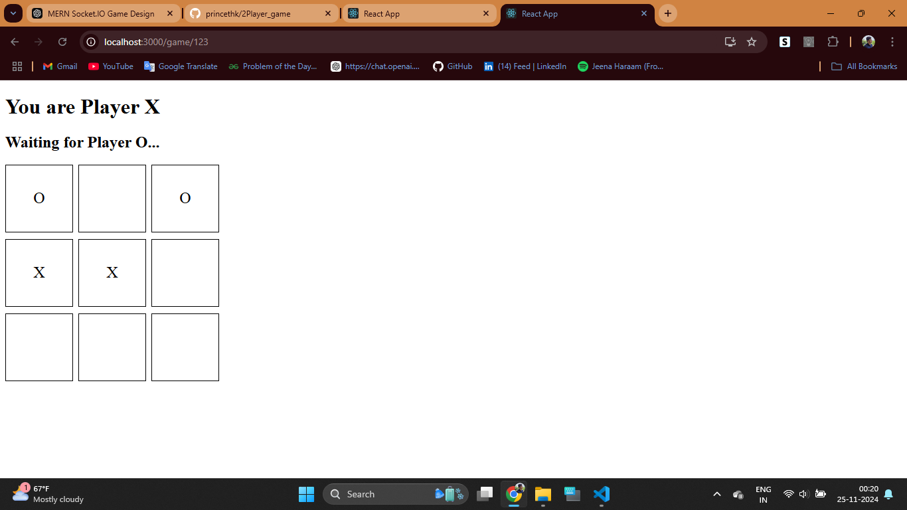

# Two-Player Tic Tac Toe Game 🎮

This is a real-time, two-player Tic Tac Toe game built using React for the frontend and Node.js with Socket.IO for the backend. Players can join a game using a unique game ID, take turns, and play in real-time with synced game states.

---

## Features

- 🎮 Real-time gameplay between two players.
- 🧩 Players are assigned roles (`O` or `X`) automatically upon joining a game.
- 🔄 Board state and turns are synchronized in real time.
- 🔐 Prevents moves when it's not a player's turn or when a cell is already occupied.
- 🔔 Visual feedback for whose turn it is.

---

## Screenshots




---

## Tech Stack

### Frontend
- **React**: For building the user interface.
- **Socket.IO Client**: For real-time communication with the backend.

### Backend
- **Node.js**: Server-side JavaScript runtime.
- **Express.js**: Web framework for creating the server.
- **Socket.IO**: For WebSocket-based real-time communication.

---

## Getting Started

### Prerequisites
Ensure you have the following installed:
- Node.js (v14+)
- npm or yarn
- React (via `create-react-app`)

---

### Installation

1. **Clone the Repository**:
   ```bash
   git clone https://github.com/your-username/two-player-tic-tac-toe.git
   cd two-player-tic-tac-toe
   ```

2. **Install Dependencies**:
   - Backend:
     ```bash
     cd backend
     npm install
     ```
   - Frontend:
     ```bash
     cd ../frontend
     npm install
     ```

3. **Start the Server**:
   ```bash
   cd backend
   node server.js
   ```

4. **Start the Frontend**:
   ```bash
   cd ../frontend
   npm start
   ```

5. Open your browser and navigate to:
   ```
   http://localhost:3000
   ```

---

## Folder Structure

```
Two-Player-/
├── backend/
│   ├── server.js           # Main backend logic
│   ├── package.json        # Backend dependencies
│   └── ...                 # Other backend files
├── frontend/
│   ├── src/
│   │   ├── components/
│   │   │   ├── Home.js     # Home component (Join Game)
│   │   │   ├── Game.js     # Game component (Game logic)
│   │   │   └── App.js      # Routes and app structure
│   ├── public/
│   └── package.json        # Frontend dependencies
└── README.md               # Project documentation
```

---

## How It Works

### Gameplay Flow
1. Player 1 enters a unique game ID on the Home screen and joins the game.
2. Player 2 enters the same game ID to join the game.
3. Players are assigned roles (`O` or `X`) in the order they join.
4. Players take turns making moves on the board. 
   - `O` always starts.
5. The game board updates in real time for both players.

### Backend Game Logic
- The server tracks each game's state (board, players, and turn).
- Validations are performed to ensure:
  - Players can only join an available game.
  - Moves are valid (player's turn, cell not occupied).
- Players are notified of the updated game state after each move.

---

## Future Enhancements

- 🔒 Add player authentication for secure gameplay.
- 🌐 Deploy the application for online multiplayer.
- 📱 Make the game responsive for mobile devices.
- 🖼️ Improve the UI with animations and better styles.

---

## Contributing

Contributions are welcome! Feel free to open an issue or submit a pull request. 

